<!-- Generated by scripts/readme.py. Edit that file, not this one. -->

<b>English</b> · <a href="https://github.com/ChiJiun/ChiJiun/blob/main/README.zh-TW.light.md">繁體中文</a> &nbsp;│&nbsp; <a href="https://github.com/ChiJiun">Auto</a> · <a href="https://github.com/ChiJiun/ChiJiun/blob/main/README.dark.md">Dark</a> · <b>Light</b>

My NSTC undergraduate research project at National Central University (Taiwan) is verifiable differential privacy for federated learning. Outside it I build small tools that run on free tiers.

Every number on this page comes from the linked repo's README or result files, and each one sits next to its limit. Team projects describe only my part.

**Contact** · [0311gino@gmail.com](mailto:0311gino@gmail.com) · [linktr.ee/0311gino](https://linktr.ee/0311gino)

### Selected work

### Also

| repo | what | my part |
|:--|:--|:--|
| [NCU_AI_Guidance](https://github.com/ChiJiun/NCU_AI_Guidance) | NCU course-advisor platform (team project) | Deployed the frontend to Firebase and the API to Render, moved research-plan PDFs to Cloudinary; Firebase Google sign-in; chat history in PostgreSQL for signed-in users; Qdrant / Cloudinary monitor page |
| [forcasting-fx-transformer](https://github.com/ChiJiun/forcasting-fx-transformer) | Fork of a senior's FX forecasting project | Added a leakage-free rolling-origin backtest to re-check the original results |
| [usdt-invoice-pulse](https://github.com/ChiJiun/usdt-invoice-pulse) | Daily USDT/TWD fee-target and e-invoice dashboard; live orders off by default | everything |
| [worldquant](https://github.com/ChiJiun/worldquant) | WorldQuant BRAIN API simulator with a one-change-at-a-time alpha research loop | everything |
| [onework](https://github.com/ChiJiun/onework) | Spring Boot + PostgreSQL meeting-room booking API with conflict guards, approvals and Testcontainers | everything |

### Activity

How this page is built

 

- Every image is an SVG generated by `scripts/`. Fira Code and Noto Sans TC (both OFL) are subset to the glyphs used and inlined, so the text looks the same on every machine.
- All motion is CSS keyframes. With reduced motion turned on you get the last frame, which is a complete picture.
- The images follow your GitHub theme by default; the switcher at the top pins dark or light.
- No third-party stats services. The activity chart is rebuilt every day by GitHub Actions from the GraphQL contribution calendar.
- `python scripts/build.py` regenerates the images; `python scripts/readme.py` writes the four README variants.

