<div align="center">

<picture>
  <source media="(prefers-color-scheme: dark)" srcset="./assets/header-dark.svg">
  <source media="(prefers-color-scheme: light)" srcset="./assets/header-light.svg">
  
</picture>

<br />

[](https://github.com/ChiJiun?tab=followers)
[](https://github.com/ChiJiun?tab=repositories)
[](#-lspositions)

</div>

<br />

### `❯ whoami`

```console
$ whoami
ChiJiun — 量化研究 · 金融資料 · 自動化

$ cat ~/.focus
[1] FX forecasting ........ PyTorch · rolling / walk-forward validation
[2] Alpha research ........ WorldQuant BRAIN · deterministic artifacts
[3] Verifiable ML ......... EZKL (zkML) · FedAvg baselines
[4] Market automation ..... funding bots · monitoring services

$ echo $PRINCIPLE
"Out-of-sample or it didn't happen."
```

<br />

### `❯ ls ~/positions`

|  # | REPO | THESIS | STACK | STATUS |
|:--:|:-----|:-------|:------|:------:|
| `01` | **[bitfinex-lending-bot](https://github.com/ChiJiun/bitfinex-lending-bot)** | Bitfinex funding 階梯掛單：貼市場利率吃成交、利率飆高自動鎖長天期 | `Python` `GH Actions` | 🟢 `LIVE` |
| `02` | **[usdt-invoice-pulse](https://github.com/ChiJiun/usdt-invoice-pulse)** | 每日 USDT 買入可行性與發票狀態儀表板 | `Python` | 🟢 `LIVE` |
| `03` | **[mvdis-watch](https://github.com/ChiJiun/mvdis-watch)** | 全台 36 監理站 × 10 照類考照場次餘額監測，單一 Worker 掃完 | `TypeScript` `CF Workers` | 🟢 `LIVE` |
| `04` | **[aws-hoyabit](https://github.com/ChiJiun/aws-hoyabit)** | 加密市場分析 AI Agent — 多源資訊交叉比對，每條判斷可回溯來源 | `Python` `LLM` | 🔷 `HACKATHON` |
| `05` | **[worldquant](https://github.com/ChiJiun/worldquant)** | BRAIN API simulator + LLM 研究員式 alpha loop（一次一個變因） | `Python` | 🟡 `RESEARCH` |
| `06` | **[TruthMLOutputAudit](https://github.com/ChiJiun/TruthMLOutputAudit)** | ML 輸出可驗證性：EZKL 證明、scale sweep、FedAvg baseline | `Python` `EZKL` | 🟡 `RESEARCH` |
| `07` | **[FX_prediction](https://github.com/ChiJiun/FX_prediction)** | 以 PyTorch 為基礎的匯率預測實驗 | `PyTorch` | 🟡 `RESEARCH` |

<sub>🟢 `LIVE` 持續運行／維護　·　🟡 `RESEARCH` 實驗迭代中　·　🔷 `HACKATHON` 競賽作品</sub>

<br />

### `❯ cat stack.toml`

| DESK | INSTRUMENTS |
|:--|:--|
| **`research`** |       |
| **`execution`** |      |
| **`infra`** |      |

<br />

### `❯ git log --stat`

<div align="center">


<br />


</div>

<br />

### `❯ echo $CONTACT`

```console
open to  ›  quantitative research · forecasting pipelines · data tooling
reach me ›  github.com/ChiJiun
```

<div align="center">
<sub>⭐ <i>If a repo here saved you time, a star always means a lot.</i></sub>
</div>
