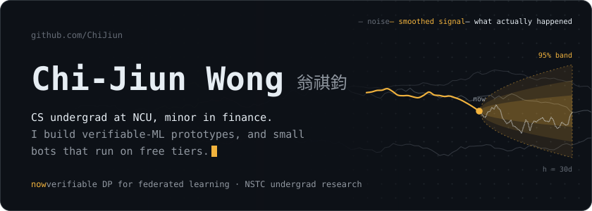
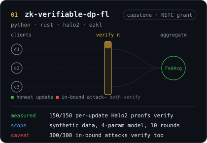
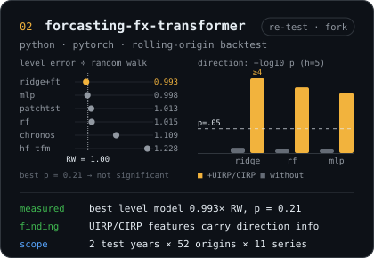
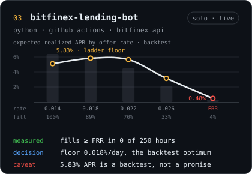
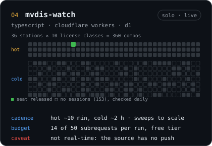
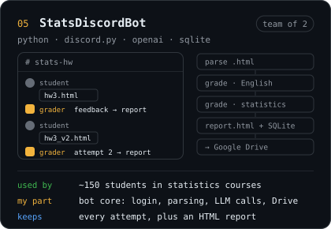
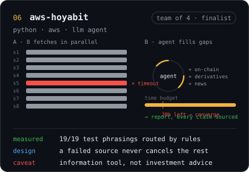
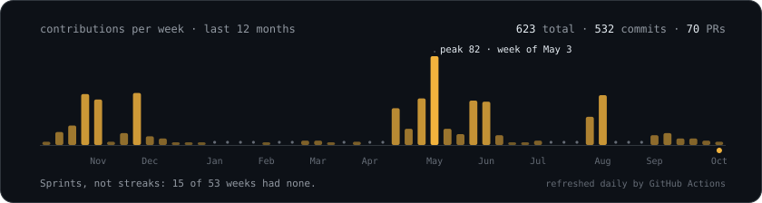

<!-- Every image here is a hand-built SVG generated by scripts/*.py. Edit the scripts, not the SVGs. -->

<picture>
  <source media="(prefers-color-scheme: dark)" srcset="./assets/hero-dark.svg">
  <source media="(prefers-color-scheme: light)" srcset="./assets/hero-light.svg">
  
</picture>

中央大學資工系，輔系財金。目前在做「可驗證差分隱私聯邦學習」的國科會大專生計畫；其餘時間做匯率預測的重新檢驗，還有幾個跑在免費額度上的小工具。

這頁上的數字都直接取自各 repo 的 README 或實驗結果，每個數字旁邊都會寫出它的限制。

### Selected work

<a href="https://github.com/ChiJiun/zk-verifiable-dp-fl"><picture><source media="(prefers-color-scheme: dark)" srcset="./assets/card-zk-dark.svg"><source media="(prefers-color-scheme: light)" srcset="./assets/card-zk-light.svg"></picture></a>
<a href="https://github.com/ChiJiun/forcasting-fx-transformer"><picture><source media="(prefers-color-scheme: dark)" srcset="./assets/card-fx-dark.svg"><source media="(prefers-color-scheme: light)" srcset="./assets/card-fx-light.svg"></picture></a>

<a href="https://github.com/ChiJiun/bitfinex-lending-bot"><picture><source media="(prefers-color-scheme: dark)" srcset="./assets/card-lending-dark.svg"><source media="(prefers-color-scheme: light)" srcset="./assets/card-lending-light.svg"></picture></a>
<a href="https://github.com/ChiJiun/mvdis-watch"><picture><source media="(prefers-color-scheme: dark)" srcset="./assets/card-mvdis-dark.svg"><source media="(prefers-color-scheme: light)" srcset="./assets/card-mvdis-light.svg"></picture></a>

<a href="https://github.com/ChiJiun/StatsDiscordBot"><picture><source media="(prefers-color-scheme: dark)" srcset="./assets/card-statsbot-dark.svg"><source media="(prefers-color-scheme: light)" srcset="./assets/card-statsbot-light.svg"></picture></a>
<a href="https://github.com/ChiJiun/aws-hoyabit"><picture><source media="(prefers-color-scheme: dark)" srcset="./assets/card-hoyabit-dark.svg"><source media="(prefers-color-scheme: light)" srcset="./assets/card-hoyabit-light.svg"></picture></a>

### Also

| repo | what | my part |
|:--|:--|:--|
| [NCU_AI_Guidance](https://github.com/ChiJiun/NCU_AI_Guidance) | 中央大學選課助理：知識圖譜 + 多代理人 RAG，涵蓋 38 個系所的 459 份大專生研究計畫 | 5 人團隊之一：負責部署（Firebase／Render／Cloudinary）、Google 登入、PostgreSQL 聊天紀錄與監控 |
| [usdt-invoice-pulse](https://github.com/ChiJiun/usdt-invoice-pulse) | 每日 USDT/TWD 手續費目標與發票紀錄 dashboard，預設不送出真實訂單 | 獨立完成 |
| [worldquant](https://github.com/ChiJiun/worldquant) | WorldQuant BRAIN API simulator，搭配一次只改一個變因的 alpha 研究流程 | 獨立完成 |
| [onework](https://github.com/ChiJiun/onework) | Spring Boot + PostgreSQL 會議室預約 API，內含衝突防護、審核流程與 Testcontainers | 獨立完成 |

### Activity

<picture>
  <source media="(prefers-color-scheme: dark)" srcset="./assets/activity-dark.svg">
  <source media="(prefers-color-scheme: light)" srcset="./assets/activity-light.svg">
  
</picture>

How this page is built

 

- 所有圖片都是 `scripts/` 產生的 SVG。字型使用 Fira Code（OFL 授權），只取用到的字元並內嵌進 SVG，所以任何機器上的顯示都一樣。
- 動畫全部用 CSS keyframes 製作。系統開啟「減少動態效果」時會直接顯示最後一格，而最後一格本身就是完整的畫面。
- 沒有使用第三方統計卡片服務，上一版頁面的統計卡片就是因為這類服務掛掉而失效。活動圖由 GitHub Actions 每天以 GraphQL 重新產生。
- `python scripts/build.py` 會重新產生全部圖片。

