<!-- Generated by scripts/readme.py. Edit that file, not this one. -->

<a href="https://github.com/ChiJiun">English</a> · <b>繁體中文</b> &nbsp;│&nbsp; <b>自動</b> · <a href="https://github.com/ChiJiun/ChiJiun/blob/main/README.zh-TW.dark.md">深色</a> · <a href="https://github.com/ChiJiun/ChiJiun/blob/main/README.zh-TW.light.md">淺色</a>

<picture><source media="(prefers-color-scheme: dark)" srcset="./assets/hero-zh-dark.svg"><source media="(prefers-color-scheme: light)" srcset="./assets/hero-zh-light.svg"></picture>

目前在做國科會大專生計畫「可驗證差分隱私聯邦學習」；其餘時間做幾個跑在免費額度上的小工具。

這頁上的數字都直接取自各 repo 的 README 或實驗結果，每個數字旁邊都寫出它的限制。團隊專案只寫我負責的部分。

**聯絡** · [0311gino@gmail.com](mailto:0311gino@gmail.com) · [linktr.ee/0311gino](https://linktr.ee/0311gino)

### 精選作品

<a href="https://github.com/ChiJiun/zk-verifiable-dp-fl"><picture><source media="(prefers-color-scheme: dark)" srcset="./assets/card-zk-zh-dark.svg"><source media="(prefers-color-scheme: light)" srcset="./assets/card-zk-zh-light.svg"></picture></a>

<a href="https://github.com/ChiJiun/bitfinex-lending-bot"><picture><source media="(prefers-color-scheme: dark)" srcset="./assets/card-lending-zh-dark.svg"><source media="(prefers-color-scheme: light)" srcset="./assets/card-lending-zh-light.svg"></picture></a>
<a href="https://github.com/ChiJiun/mvdis-watch"><picture><source media="(prefers-color-scheme: dark)" srcset="./assets/card-mvdis-zh-dark.svg"><source media="(prefers-color-scheme: light)" srcset="./assets/card-mvdis-zh-light.svg"></picture></a>

<a href="https://github.com/ChiJiun/StatsDiscordBot"><picture><source media="(prefers-color-scheme: dark)" srcset="./assets/card-statsbot-zh-dark.svg"><source media="(prefers-color-scheme: light)" srcset="./assets/card-statsbot-zh-light.svg"></picture></a>
<a href="https://github.com/ChiJiun/aws-hoyabit"><picture><source media="(prefers-color-scheme: dark)" srcset="./assets/card-hoyabit-zh-dark.svg"><source media="(prefers-color-scheme: light)" srcset="./assets/card-hoyabit-zh-light.svg"></picture></a>

### 其他

| repo | 內容 | 我負責 |
|:--|:--|:--|
| [NCU_AI_Guidance](https://github.com/ChiJiun/NCU_AI_Guidance) | 中央大學選課助理平台（團隊專案） | 前端部署到 Firebase、API 部署到 Render、研究計畫 PDF 移到 Cloudinary；Firebase Google 登入；已登入使用者的聊天紀錄存進 PostgreSQL；Qdrant／Cloudinary 監控頁 |
| [forcasting-fx-transformer](https://github.com/ChiJiun/forcasting-fx-transformer) | 學長匯率預測專題的 fork | 加入無資料洩漏的 rolling-origin 回測，重新檢驗原本的結果 |
| [usdt-invoice-pulse](https://github.com/ChiJiun/usdt-invoice-pulse) | 每日 USDT/TWD 手續費目標與發票紀錄 dashboard，預設不送出真實訂單 | 全部 |
| [worldquant](https://github.com/ChiJiun/worldquant) | WorldQuant BRAIN API simulator，搭配一次只改一個變因的 alpha 研究流程 | 全部 |
| [onework](https://github.com/ChiJiun/onework) | Spring Boot + PostgreSQL 會議室預約 API，內含衝突防護、審核流程與 Testcontainers | 全部 |

### 活動

<picture><source media="(prefers-color-scheme: dark)" srcset="./assets/activity-zh-dark.svg"><source media="(prefers-color-scheme: light)" srcset="./assets/activity-zh-light.svg"></picture>

這頁怎麼做的

 

- 所有圖片都是 `scripts/` 產生的 SVG。Fira Code 與 Noto Sans TC（皆為 OFL 授權）只取用到的字元並內嵌，任何機器上顯示都一樣。
- 動畫全部用 CSS keyframes 製作。系統開啟「減少動態效果」時直接顯示最後一格，而最後一格本身就是完整的畫面。
- 圖片預設跟隨你的 GitHub 主題；最上方的切換列可以固定為深色或淺色。
- 沒有使用第三方統計卡片服務。活動圖由 GitHub Actions 每天用 GraphQL 貢獻資料重新產生。
- `python scripts/build.py` 重新產生圖片；`python scripts/readme.py` 產生四個語言／主題版本的 README。

